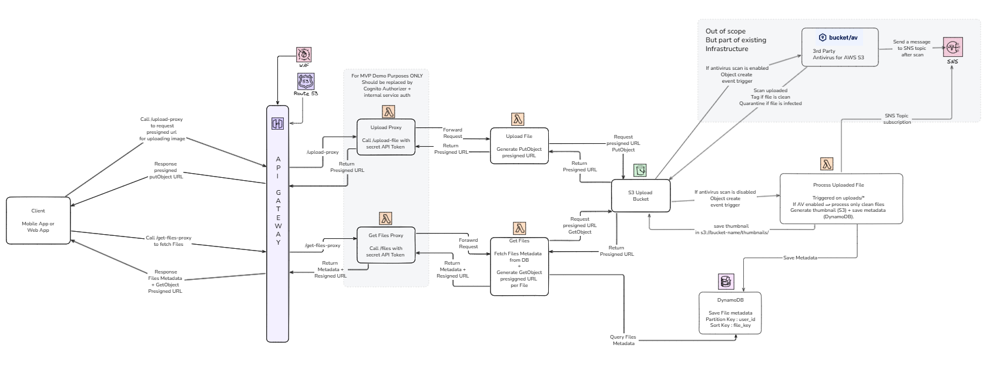

# File Uploader Infrastructure – Managed with Terraform on AWS
**🟢 Pipeline Status**


> 🚧 **v1.7.0-beta.x**  
> This version is only provided for demo purposes

## Overview

This project provides a **Terraform module** that allows clients to upload files securely to AWS.
It supports **optional malware scanning via BucketAV**, thumbnail generation for image files, and user metadata storage
in DynamoDB.
This infrastructure is **100% serverless**.

**Flow overview:**

1. Client requests a presigned URL from an API endpoint exposed via **API Gateway**.
2. Client **uploads the file directly to S3** using the presigned URL.
3. If **BucketAV** is enabled:
    - The upload triggers a scan.
    - BucketAV publishes results to an SNS topic.
    - Lambda subscribed to the topic generates thumbnails and saves metadata in DynamoDB.
4. If BucketAV is **disabled**:
    - Lambda is triggered directly by the **S3 object creation notification**.
5. In case of image file, a generated thumbnail is stored in a dedicated S3 folder `thumbnails/`, and metadata (file
   key, thumbnail key, user ID, etc.) is recorded in **DynamoDB**.



> 🚧 **Demo Notes:**  
> A lightweight Lambda **proxy** layer simulates a backend authorizer.
> - Prevents exposing API secrets to the frontend
> - In production, replace with **Cognito Authorizer** on API Gateway

## Usage

Use in a terraform project by importing the module:

```text
module "file_uploader" {
  source = "git::https://github.com/lrasata/infra-file-uploader.git//modules/file_uploader?ref=v1.0.0"

  region                                        = var.region
  environment                                   = var.environment
  api_file_upload_domain_name                   = var.api_file_upload_domain_name
  backend_certificate_arn                       = var.backend_certificate_arn
  uploads_bucket_name                           = var.uploads_bucket_name
  enable_transfer_acceleration                  = var.enable_transfer_acceleration
  lambda_upload_presigned_url_expiration_time_s = var.lambda_upload_presigned_url_expiration_time_s
  use_bucketav                                  = var.use_bucketav
  bucketav_sns_findings_topic_name              = var.bucketav_sns_findings_topic_name
}
```

**Outputs**

The module provides the following outputs.

````text
output "api_gateway_invoke_url" {
  description = "Public URL for invoking the API Gateway"
  value       = "https://${var.api_file_upload_domain_name}/upload"
}

output "uploads_bucket_id" {
  description = "The S3 uploads bucket ID (name)"
  value       = module.s3_bucket.uploads_bucket_id
}

output "uploads_bucket_arn" {
  description = "The ARN of the S3 uploads bucket"
  value       = module.s3_bucket.uploads_bucket_arn
}

output "uploads_bucket_regional_domain_name" {
  description = "The regional domain name of the S3 bucket (for CloudFront origin)"
  value       = module.s3_bucket.uploads_bucket_regional_domain_name
}

output "dynamo_db_table_name" {
  description = "The name of the DynamoDB table"
  value       = module.dynamodb.files_metadata_table_name
}


Usage : 
origin_bucket_arn = module.file_uploader.uploads_bucket_arn
````

### Accessing objects in the private S3 uploads bucket

> 🚧 **v1.7.0-beta.x**  
> This version is only provided for demo purposes

For this project, we use a **Lambda proxy** to handle secure access to S3 objects.

- To **upload files**, use the `/upload-proxy` endpoint.
- To **fetch files**, use the `/files-proxy` endpoint.

This proxy currently handles request forwarding and signing presigned URLs for S3, keeping the bucket private.  
In a production deployment, you could replace this proxy with a proper authentication layer such as **API Gateway + Cognito Authorizer** or a **CloudFront distribution with signed URLs**, depending on your security requirements.


## Key attributes

### Security

- **Presigned URLs** are used for uploads and downloads, granting temporary, time-limited access to specific objects without exposing AWS credentials.
- All files are stored in **S3 encrypted with SSE-KMS using Customer Managed Keys (CMK)**  at rest.
- **Public access blocked** on the S3 uploads bucket to prevent unauthorized access.
- Optional **BucketAV integration** to scan for malware before files are processed.
    - BucketAV scan is triggered after each upload and by default it deletes any infected file. (This behaviour can be
      changed in BucketAV settings)

### Reliability

- Lambda ensures **automatic scaling and high availability**.
- S3 provides effective unlimited storage.
    - Maximum object size: 5 TB per object.
    - Maximum number of objects per bucket: unlimited.
- SNS delivery ensures Lambda processing occurs only after BucketAV scan completes. **Lambda only process files which
  are tagged "clean" by BucketAV.**

### Scalability

- Lambda scales automatically with incoming SNS messages or S3 events.
- Optional **S3 Transfer Acceleration** provides global upload speed improvements.

### Maintainability

- **This Terraform project is built as a module**, it makes it easy to re-use across projects and environments.
- **Environment-specific variables** allow dev/staging/prod separation.
- Lambda functions are decoupled from S3 and SNS triggers, making updates safe and predictable.

## Monitoring 

### S3 Uploads bucket Alerts and Metrics

Critical Alerts (CloudWatch → SNS → Email) triggered when Failed uploads > 5

- 4xxErrors
- 5xxErrors

CloudWatch metrics 4xxErrors and 5xxErrors capture any request that reaches S3 but fails.

- Captured Client Errors (4xx)
- AccessDenied (bad IAM permissions)
- InvalidAccessKeyId
- SignatureDoesNotMatch
- Upload to the wrong bucket or prefix
- Missing ACL permissions
- Multipart upload part rejected
- Incorrect use of presigned URLs
- Captured Server Errors (5xx)
- Internal S3 errors (rare)
- Throttling
- Transient S3 failures

**Additional S3 Metrics on Dashboard**

| Metric                      | Description                                 |
|-----------------------------|---------------------------------------------|
| **BucketSizeBytes**         | Total storage used                          |
| **NumberOfObjects**         | Number of files stored                      |
| **S3ObjectCreated**         | Number of uploads per time window           |
| **S3EventNotificationSent** | Should match number of *successful* uploads |

This validates that uploads → events → Lambda chain is functioning correctly.

### API Gateway Metrics

| Metric                          | Unit  | Description                            |
|---------------------------------|-------|----------------------------------------|
| **PresignURLRequests**          | Count | Total number of presigned URL requests |
| **PresignURLSuccess**           | Count | Track healthy traffic levels           |
| **PresignURLFailed**            | Count | Detect permission/config issues        |
| **Latency**                     | ms    | Identify slow API behavior             |
| **5XXError (Cloudwatch Alarm)** | Count | API internal server failures           |
| **4XXError (Cloudwatch Alarm)** | Count | Authentication or malformed requests   |

### DynamoDB Metadata writer Metrics

| Metric                                                | Unit  | Why It Matters                        |
|-------------------------------------------------------|-------|---------------------------------------|
| **DynamoWrites**                                      | Count | Should match number of clean uploads  |
| **DynamoWriteFailed (Cloudwatch Alarm)**              | Count | Permission or schema issues           |
| **DynamoLatency**                                     | ms    | Detect DynamoDB slowness              |
| **WriteThrottleEvents (Cloudwatch Alarm)**            | Count | Capacity problems → risk of data loss |
| **ConditionalCheckFailedRequests (Cloudwatch Alarm)** | Count | Duplicate keys or constraint issues   |

### Thumbnail Generation Lambda Metrics

| Metric                        | Unit  | Description                                    |
|-------------------------------|-------|------------------------------------------------|
| **ThumbnailRequested**        | Count | Number of times thumbnail processing triggered |
| **ThumbnailGenerated**        | Count | Successful thumbnail creation                  |
| **ThumbnailFailed**           | Count | Sharp processing errors, corrupt files         |
| **ThumbnailDuration**         | ms    | Performance tracking                           |
| **ThumbnailLambdaErrors**     | Count | Lambda crashes or unhandled exceptions         |

## Infrastructure choices

### Why use DynamoDB instead of RDS

Using S3 for file storage is a standard practice, but for metadata storage I chose DynamoDB over a relational database (
RDS).

- **Serverless alignment**: DynamoDB integrates naturally with the rest of the serverless stack (S3 + Lambda + API
  Gateway), ensuring consistent scalability and availability without managing servers.
- **Scalability & performance**: DynamoDB scales automatically with unpredictable upload traffic, delivering
  single-digit millisecond latency for lookups.
- **Fit for the use case**: The file uploader only requires simple, fast lookups (e.g., get file key or thumbnail URL by
  user). This doesn’t require complex relational queries, making DynamoDB the most efficient choice.

### Why BucketAV (or another proprietary AV) instead of using ClamAV (open-source) in Lambda

**TL;DR** For enterprise-grade, scalable, and low-maintenance infrastructure, a managed AV solution such as BucketAV is
the pragmatic choice. While it reduces engineering overhead, it comes at [a cost](https://bucketav.com/pricing/) but it
often proves cheaper in the long run when factoring in DevOps time, maintenance, and risk.

**Key considerations:**

- **Operational simplicity:** BucketAV abstracts away the AV infrastructure and is delivered as a ready-to-use
  CloudFormation stack with configurable options.
- **Maintenance burden:** Running ClamAV inside Lambda requires building and maintaining a Lambda Layer with ClamAV
  binaries and virus definitions. Building that layer (from experience) is painful and comes with challenges:
    - Lambda layer size limit (250 MB uncompressed) can easily be exceeded by ClamAV signatures.
    - Requires cross-compiling ClamAV for Amazon Linux 2.
    - Virus definitions must be constantly updated, requiring rebuilds and redeployments.

With BucketAV (or equivalent managed AV), patching, signature updates, and scaling are handled by the vendor.
Managed solutions like BucketAV provide features out of the box:

- Quarantine buckets for infected files
- Integration with SNS (used here to trigger downstream Lambda only after a file is marked “clean”)
- Logging, monitoring, and compliance reporting